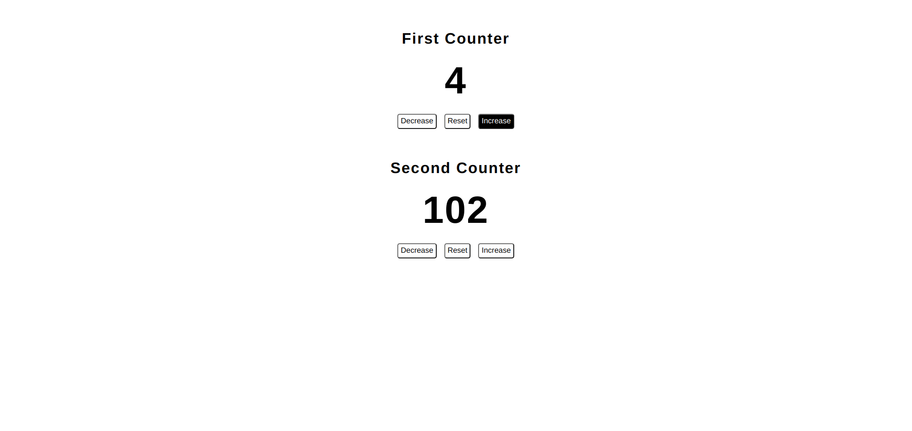

# DOUBLE COUNTER PROJECT

## FRONTEND PRACTICE PROJECT NO: 15

1. I used Javascript, Jquery, HTML, CSS to practice my skills.

2. There are 2 different counter which you can decrease, increase and reset individually.
